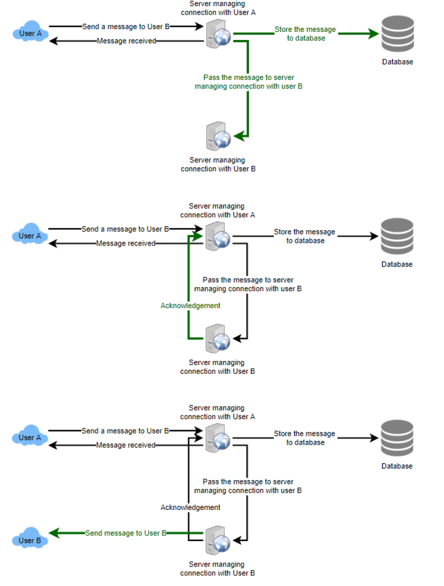

# 设计 API Rate Limiter

## 设计 API Rate Limiter

让我们设计一个 API Rate Limiter，它将根据用户发送的请求数量来限制用户。

难度级别：中等

&#x20;

### 1、什么是Rate Limiter

想象一下，我们有一个服务正在接收大量请求，但它每秒只能处理有限数量的请求。为了处理这个问题，我们需要某种限制或速率限制机制，只允许一定数量的请求，以便我们的服务可以响应所有请求。速率限制器在较高级别限制实体（用户、设备、IP 等）在特定时间窗口内可以执行的事件数量。例如：

* 用户每秒只能发送一条消息。
* 每天只允许用户进行三笔失败的信用卡交易。
* 一个IP每天只能创建二十个账号。

通常，速率限制器会限制发送者在特定时间窗口内可以发出多少请求。一旦达到上限，它就会阻止请求。

### 2、为什么我们需要API rate limiting？

速率限制有助于保护服务免受针对应用层的滥用行为，例如[拒绝服务 (DOS)](https://en.wikipedia.org/wiki/Denial-of-service\_attack)攻击、暴力破解密码尝试、暴力信用卡交易等。这些攻击通常是一连串的 HTTP/S 请求这可能看起来像是来自真实用户，但通常是由机器（或机器人）生成的。因此，这些攻击通常更难检测，并且更容易导致服务、应用程序或 API 瘫痪。

速率限制还用于防止收入损失、降低基础设施成本、阻止垃圾邮件和阻止在线骚扰。以下是可以通过使服务（或 API）更可靠而受益于速率限制的场景列表：

* **行为不端的客户端/脚本：**无论是有意还是无意，一些实体都可能通过发送大量请求来压倒服务。另一种情况可能是当用户发送大量低优先级请求时，我们希望确保它不会影响高优先级流量。例如，不应允许发送大量分析数据请求的用户妨碍其他用户的关键交易。
* **安全性：** 通过限制允许用户执行的第二因素尝试（在 2 因素身份验证中）的次数，例如，允许他们使用错误密码尝试的次数。
* **为了防止滥用行为和不良设计实践：** 如果没有 API 限制，客户端应用程序的开发人员将使用草率的开发策略，例如，一遍又一遍地请求相同的信息。
* **控制成本和资源使用：**服务通常是为正常的输入行为而设计的，例如，用户在一分钟内写一篇文章。计算机可以通过 API 轻松推送数千/秒。速率限制器启用对服务 API 的控制。
* **收入：** 某些服务可能希望根据其客户服务的层级来限制运营，从而创建基于速率限制的收入模型。服务提供的所有 API 都可能存在默认限制。要超出此范围，用户必须购买更高的限额
* **消除流量高峰：**确保为其他所有人提供服务。

### 3、系统的要求和目标

我们的Rate limiter应满足以下要求：

#### 功能要求

1. 限制一个实体在一个时间窗口内可以向 API 发送的请求数量，例如每秒 15 个请求。
2. API 可通过集群访问，因此应考虑跨不同服务器的速率限制。每当在单个服务器或多个服务器组合中超过定义的阈值时，用户应该会收到一条错误消息。

**非功能性要求：**

1. 系统应该是高度可用的。速率限制器应该始终有效，因为它可以保护我们的服务免受外部攻击。
2. 我们的速率限制器不应引入影响用户体验的大量延迟。

### **4、**限速怎么做？

**速率限制**是一个过程，用于定义消费者可以访问 API 的速率和速度。**限制**是在给定时间段内控制客户对 API 的使用的过程。可以在应用程序级别和/或 API 级别定义限制。当超过油门限制时，服务器返回 HTTP 状态“429 - 请求过多”。

### 5、有哪些不同类型的throttling（限流）？

以下是不同服务使用的三种著名的throttling类型：

**Hard Throttling：** API 请求数不能超过限制。

**Soft Throttling：**在这种类型中，我们可以将 API 请求限制设置为超过一定百分比。例如，如果我们的速率限制为每分钟 100 条消息并且 10% 超出限制，那么我们的速率限制器将允许每分钟最多 110 条消息。

**弹性或动态节流**：在弹性节流下，如果系统有一些可用资源，请求数可能会超过阈值。例如，如果一个用户每分钟只允许发送 100 条消息，我们可以让该用户每分钟发送超过 100 条消息，当系统中有可用资源时。

### 6、Rate Limiter有哪些不同类型的算法？

以下是用于速率限制的两种算法：

**固定窗口算法：**在该算法中，时间窗口被认为是从时间单位的开始到时间单位的结束。例如，一个时间段将被认为是 0-60 秒一分钟，而不管 API 请求发出的时间范围如何。在下图中，0-1 秒之间有两条消息，1-2 秒之间有 3 条消息。如果我们的速率限制为每秒两条消息，则此算法将仅限制“m5”。

\


<figure><figcaption></figcaption></figure>

**滚动窗口算法：**在此算法中，时间窗口是从发出请求的时间加上时间窗口长度的一部分来考虑的。例如，如果在一秒的第 300 毫秒和第 400 毫秒发送了两条消息，我们将从该秒的第 300 毫秒到下一秒的第 300 毫秒将它们计为两条消息。在上图中，每秒保持两条消息，我们将限制“m3”和“m4”。


### 7、Rate Limiter 的高级设计

Rate Limiter 将负责决定 API 服务器将处理哪个请求以及拒绝哪个请求。一旦一个新的请求到达，Web 服务器首先要求速率限制器来决定是服务还是限制它。如果请求没有受到限制，那么它将被传递到 API 服务器。

<figure><figcaption></figcaption></figure>

### 8、基本系统设计与算法

让我们以我们想要限制每个用户的请求数为例。在这种情况下，对于每个唯一用户，我们将保留一个表示该用户发出了多少请求的计数以及我们开始计算请求时的时间戳。我们可以将它保存在一个哈希表中，其中“key”是“UserID”，“value”是一个结构，其中包含一个表示“Count”的整数和一个表示 Epoch 时间的整数：

<figure><figcaption></figcaption></figure>

假设我们的速率限制器允许每个用户每分钟三个请求，因此每当有新请求进入时，我们的速率限制器将执行以下步骤：

1. 如果哈希表中不存在“UserID”，则插入它，将“Count”设置为 1，将“StartTime”设置为当前时间（标准化为一分钟），然后允许请求。
2. 否则，查找'UserID'的记录，如果是`CurrentTime – StartTime >= 1 min`，将'StartTime'设置为当前时间，'Count'设置为1，并允许请求。
3. 如果`CurrentTime - StartTime <= 1 min`和
   * 如果 'Count < 3'，增加 Count 并允许请求。
   * 如果'Count >= 3'，拒绝请求。

<figure><figcaption></figcaption></figure>

**我们的算法有哪些问题？**

* 这是一个**固定窗口**算法，因为我们在每分钟结束时重置“StartTime”，这意味着它可能允许每分钟请求数量的两倍。想象一下，如果 Kristie 在一分钟的最后一秒发送了三个请求，那么她可以立即在下一分钟的第一秒再发送三个请求，从而在两秒内产生 6 个请求。这个问题的解决方案是滑动窗口算法，我们将在后面讨论。

<figure><figcaption></figcaption></figure>

* **原子性：**在分布式环境中，“先读后写”行为会产生竞争条件。想象一下，如果 Kristie 当前的“计数”是“2”并且她再发出两个请求。如果两个单独的进程为这些请求中的每一个提供服务，并在其中任何一个更新计数之前同时读取计数，则每个进程都会认为 Kristie 可以再收到一个请求并且她没有达到速率限制。

<figure><figcaption></figcaption></figure>

如果我们使用[Redis](https://en.wikipedia.org/wiki/Redis)来存储我们的键值，解决原子性问题的一种解决方案是在读取更新操作期间使用[Redis 锁](https://redis.io/topics/distlock)_（作者这里是不是忘记了redis可以使用lua脚本保证原子性）_。然而，这将以减慢来自同一用户的并发请求并引入另一层复杂性为代价。我们可以使用[Memcached](https://en.wikipedia.org/wiki/Memcached)，但它会有类似的复杂性。

如果我们使用简单的哈希表，我们可以有一个自定义实现来“锁定”每条记录以解决我们的原子性问题。

**我们需要多少内存来存储所有用户数据？**让我们假设一个简单的解决方案，我们将所有数据保存在哈希表中。

假设“UserID”占用 8 个bytes。我们还假设一个 2 bytes的“计数”，最多可以计数 65k，足以满足我们的用例。虽然 epoch 时间需要 4 bytes，但我们可以选择只存储分钟和秒部分，这可以容纳 2 bytes。因此，我们总共需要 12 个bytes来存储用户的数据：

```
8 + 2 + 2 = 12 bytes
```

假设我们的哈希表对每条记录有 20 bytes的开销。如果我们需要随时跟踪一百万用户，我们需要的总内存为 32MB：

```
(12 + 20) bytes * 100 万 => 32MB
```

如果我们假设我们需要一个 4 bytes的数字来锁定每个用户的记录来解决我们的原子性问题，那么我们总共需要 36MB 内存。

这可以很容易地安装在单个服务器上；但是，我们不希望通过一台机器路由所有流量。此外，如果我们假设每秒 10 个请求的速率限制，这将转化为我们的速率限制器的 1000 万个 QPS！这对于单个服务器来说太多了。实际上，我们可以假设我们会在分布式设置中使用 Redis 或 Memcached 类型的解决方案。我们会将所有数据存储在远程 Redis 服务器中，并且所有 Rate Limiter 服务器将在服务或限制任何请求之前读取（和更新）这些服务器。

### 9、滑动窗口算法。

如果我们可以跟踪每个用户的每个请求，我们就可以维护一个滑动窗口。我们可以将每个请求的时间戳存储在哈希表的“值”字段中的 Redis [Sorted Set](https://redis.io/docs/data-types/)中。

<figure><figcaption></figcaption></figure>

假设我们的速率限制器允许每个用户每分钟三个请求，因此，每当有新请求进入时，速率限制器将执行以下步骤：

1. 从排序集中删除所有早于“CurrentTime - 1 分钟”的时间戳。
2. 计算排序集中的元素总数。如果此计数大于我们的限制“3”，则拒绝请求。
3. 在排序集中插入当前时间并接受请求。

<figure><figcaption></figcaption></figure>

**我们需要多少内存来存储滑动窗口的所有用户数据？**假设“UserID”占用 8 bytes。每个纪元时间将需要 4 bytes。假设我们需要每小时 500 个请求的速率限制。让我们假设哈希表有 20 bytes的开销，排序集有 20 bytes的开销。最大时，我们总共需要 12KB 来存储一个用户的数据：

```
8 + (4 + 20 (排序集开销)) * 500 + 20 (哈希表开销) = 12KB
```

这里我们为每个元素保留 20 bytes的开销。在有序集合中，我们可以假设我们至少需要两个指针来维持元素之间的顺序——一个指向前一个元素，一个指向下一个元素。在 64 位机器上，每个指针将占用 8 个bytes。所以我们需要 16 bytes的指针。我们添加了一个额外的字（4 bytes）来存储其他开销。

如果我们需要随时跟踪一百万用户，我们需要的总内存为 12GB：

```
12KB * 100 万 ~= 12GB
```

与固定窗口相比，滑动窗口算法占用大量内存；这将是一个可扩展性问题。如果我们可以结合以上两种算法来优化我们的内存使用呢？


### 10、带计数器的滑动窗口

如果我们使用多个固定时间窗口（例如，我们的速率限制时间窗口大小的 1/60）来跟踪每个用户的请求计数会怎样。例如，如果我们有一个每小时速率限制，我们可以保留每分钟的计数，并在我们收到计算限制限制的新请求时计算过去一小时内所有计数器的总和。这将减少我们的内存占用。让我们举个例子，我们将速率限制为每小时 500 个请求，另外限制为每分钟 10 个请求。这意味着当过去一小时内带有时间戳的计数器的总和超过请求阈值（500）时，Kristie 已经超过了速率限制。除此之外，她每分钟发送的请求不能超过十个。这将是一个合理且实用的考虑，因为没有一个真正的用户会发送频繁的请求。即使他们这样做，

我们可以将我们的计数器存储在[Redis Hash](https://redis.io/topics/data-types)中，因为它为少于 100 个键提供了令人难以置信的高效存储。当每个请求在散列中增加一个计数器时，它也会将散列设置为在一小时后[过期。](https://redis.io/commands/ttl)我们会将每个“时间”标准化为一分钟。

\
\


<figure><figcaption></figcaption></figure>

**我们需要多少内存来存储带有计数器的滑动窗口的所有用户数据？**假设“UserID”占用 8 bytes。每个纪元时间需要 4 bytes，计数器需要 2 bytes。假设我们需要每小时 500 个请求的速率限制。假设哈希表的开销为 20 bytes，Redis 哈希的开销为 20 bytes。由于我们将记录每分钟，因此每个用户最多需要 60 个条目。我们总共需要 1.6KB 来存储一个用户的数据：

```
8 + (4 + 2 + 20 (Redis 哈希开销)) * 60 + 20 (哈希表开销) = 1.6KB
```

如果我们需要随时跟踪一百万用户，我们需要的总内存为 1.6GB：

```
1.6KB * 100 万 ~= 1.6GB
```

因此，我们的“带计数器的滑动窗口”算法使用的内存比简单滑动窗口算法少 86%。


### 11、数据分片和缓存 <a href="#div-stylecolorblack-background-colore2f4c7-border-radius5px-padding5px11-data-sharding-and-cachingdi" id="div-stylecolorblack-background-colore2f4c7-border-radius5px-padding5px11-data-sharding-and-cachingdi"></a>

我们可以根据 "UserID "分片来分配用户的数据。对于容错和复制，我们应该使用[Consistent Hashing](https://www.educative.io/courses/grokking-the-system-design-interview/B81vnyp0GpY)。如果我们想对不同的API有不同的节流限制，我们可以选择对每个用户每个API进行分片。以[URL Shortener](she-ji-xiang-tinyurl-zhe-yang-de-url-suo-duan-fu-wu.md)为例，我们可以为每个用户或IP的createURL()和deleteURL()API设置不同的速率限制器。

如果我们的API是分区的，一个实际的考虑可以是为每个API分片设置一个单独的（稍小的）速率限制器。让我们以我们的URL缩短器为例，我们想限制每个用户每小时不能创建超过100个短URL。假设我们对createURL()API使用了基于哈希的分区，我们可以对每个分区进行速率限制，允许用户除了每小时创建100个短网址之外，每分钟还不能超过三个短网址。

我们的系统可以从缓存最近的活跃用户中获得巨大的好处。应用程序服务器可以在访问后端服务器之前快速检查缓存是否具有所需的记录。我们的速率限制器可以通过仅更新缓存中的所有计数器和时间戳来显着受益于**回写**缓存。可以以固定的时间间隔对永久存储进行写入。通过这种方式，我们可以确保速率限制器为用户请求添加的延迟最小。读取总是可以先命中缓存；一旦用户达到最大限制，这将非常有用，并且速率限制器只会读取数据而不进行任何更新。

最近最少使用（LRU）可能是我们系统的合理缓存驱逐策略。


### 12、是按IP限速还是按用户限速？ <a href="#div-stylecolorblack-background-colore2f4c7-border-radius5px-padding5px12-should-we-rate-limit-by-ip" id="div-stylecolorblack-background-colore2f4c7-border-radius5px-padding5px12-should-we-rate-limit-by-ip"></a>

让我们讨论使用这些方案中的每一个的优缺点：

**IP：**在这个方案中，我们限制每个 IP 的请求；尽管在区分“好”和“坏”演员方面并不是最佳的，但总比完全没有速率限制要好。基于 IP 的限制的最大问题是当多个用户共享一个公共 IP 时，例如网吧或使用同一网关的智能手机用户。一位不良用户可能会导致其他用户受到限制。在缓存基于 IP 的限制时可能会出现另一个问题，因为即使是一台计算机也有大量 IPv6 地址可供黑客使用，因此让服务器在跟踪 IPv6 地址时耗尽内存是微不足道的！

**用户：**用户认证后可以对 API 进行速率限制。一旦通过身份验证，用户将获得一个令牌，用户将在每个请求中传递该令牌。这将确保我们将对具有有效身份验证令牌的特定 API 进行速率限制。但是如果我们必须对登录 API 本身进行速率限制呢？这种速率限制的弱点是黑客可以通过输入错误的凭据来对用户执行拒绝服务攻击。之后，实际用户将无法登录。

_**如果我们结合以上两种方案呢？**_

**混合：**一个正确的方法可能是同时进行每个 IP 和每个用户的速率限制，因为它们在单独实施时都有弱点，但是，这将导致更多的缓存条目和每个条目的更多详细信息，因此需要更多的内存和存储空间.
